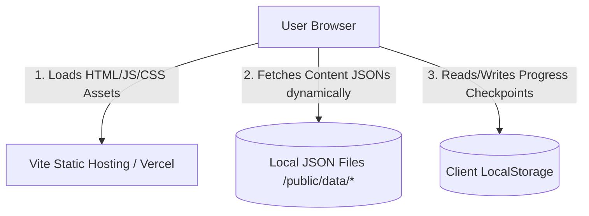

# algoNERD - Comprehensive Project Analysis & Architectural Report

---

## 1. Project Overview

### Project Name
**algoNERD** (styled as **algoNERD - The Complete Guide For DSA**)

### One-line Description
A premium, localized interactive developer-centric web application designed to help users master Data Structures and Algorithms (DSA) through high-fidelity code solutions, step-by-step logic breakdowns, dry run visualizations, and progressive local checkpointing.

### Elevator Pitch (50 words)
Stop memorizing, start engineering. **algoNERD** is a premium developer-centric web platform that teaches DSA by focusing on deep logic, dry run visualizations, and multi-language solutions (C++, Java, Python). With a sleek command-line aesthetic and localized progress tracking, it trains students to solve complex problems in their native desktop IDEs.

### Executive Summary (150-300 words)
**algoNERD** is a lightweight, responsive, client-side web application designed to bridge the gap between traditional learning tools (which often restrict students to rigid browser-based environments) and real-world software engineering setups. Built with **React 19**, **Vite**, **React Router v7**, and **Tailwind CSS v4**, the application features a dark green terminal aesthetic, custom animations powered by **Framer Motion**, and a modular, easily maintainable architecture.

The project is structured around a static-database model utilizing structured JSON files to store rich metadata for 19 distinct DSA topics (e.g., Arrays, Trees, Dynamic Programming, Backtracking). Each coding challenge contains thorough descriptions, core concepts, underlying theory, algorithmic explanations, line-by-line dry runs, and optimized source code versions in C++, Python, and Java. 

Progress is tracked dynamically using client-side **LocalStorage** integration, enabling users to complete items offline and reset their learning metrics on demand. While the repository contains a backend skeleton (Node.js and Express), the core application is currently designed as a serverless static site deployed onto platforms like Vercel. This architecture keeps operations simple, highly performant, and zero-cost, while delivering a sleek, professional aesthetic.

### Problem Statement
Standard DSA learning platforms (e.g., LeetCode, HackerRank) enforce a browser-only environment, leading to a disconnect between a developer's preparation setup and their actual daily working tools. Furthermore, typical solution platforms focus primarily on pass/fail status and optimal time complexity numbers, often skipping the intermediate thought processes, line-by-line variable states during dry runs, and conceptual background needed to build real problem-solving intuition.

### Motivation Behind the Project
The motivation is to foster a "real-environment" mindset. By encouraging students to code in their own desktop IDEs (such as VS Code, CLion, or IntelliJ IDEA) and referencing **algoNERD** for granular conceptual alignment, developers build authentic compilation, debugging, and memory-management skills. The app's design system replicates modern terminal themes, creating an environment that feels familiar and professional.

### Target Users
- Computer Science students preparing for technical internships and jobs.
- Self-taught developers transitioning into software engineering.
- Experienced engineers seeking a quick, visual refresher on data structures and complex algorithms (such as DP, graphs, and backtracking).

### Real-World Use Case
A student prepares for a big-tech coding interview. Instead of fighting browser-only editor quirks, they open CLion, write their solutions locally using standard input/output channels, and use **algoNERD** to compare their logic with multi-language optimized solutions, visually trace the step-by-step dry runs, and log their progress on their local computer.

### Industry/Domain
EdTech, Software Engineering Training, Interview Preparation, and Developer Productivity Tools.

---

## 2. Technical Architecture

### Overall Architecture
The project follows a **Serverless Client-Side Single-Page Application (SPA)** model. The frontend is built as a static build package (distributed via Vite) which loads dynamically structured static data from a public assets directory at runtime. 

*Confidence: High* (Inferred from the complete absence of active routes in `backend/server.js` and the presence of `vercel.json` rewriting all routing to the root client handler).



### Frontend Architecture
The client is structured as a React 19 single-page app utilizing:
- **Router**: `react-router-dom` (v7) handles client-side route paths (`/`, `/curriculum`, and `/question/:id`).
- **Data Fetching**: Standard declarative React `useEffect` hooks fetching static JSON resources (`/data/syllabus.json` and details like `/data/ArrayQuestions.json`) at runtime.
- **Rendering Lifecycle**: React renders details dynamically, resetting DOM scroll position upon navigation via client-side scripts.
- **Styling Layer**: Modular vanilla CSS combined with global variable tokens and Tailwind CSS integrations.

### Backend Architecture
Currently, the backend consists of a skeleton directory containing:
- `package.json` specifying an Express dependency.
- An empty `server.js` (0 bytes).

*Confidence: High* (Confirmed by reading the code in `backend/server.js`). The application does not currently make any REST calls to an active Express backend; all pages and questions are resolved entirely on the client side.

### Database Architecture
There is no database management system (DBMS) like PostgreSQL, MongoDB, or MySQL. The "database" is constructed using static JSON files hosted inside the `frontend/public/data` directory:
- `syllabus.json`: A catalog of all categories, category names, question IDs, and high-level descriptors (difficulty, tags).
- Individual Category files (e.g., `PatternQuestions.json`, `ArrayQuestions.json`): Contain full question schemas, code solutions, explanations, and dry runs.

### Authentication Flow
No authentication system is implemented. The application is completely open-access. 

### API Flow
The application mimics a REST API using file-based GET endpoints:
1. When mounting the `/curriculum` page, the client performs a `fetch("/data/syllabus.json")` to render the overview list.
2. When mounting the `/question/:id` page:
   - First, the client fetches `/data/syllabus.json` to scan which `detail_file` holds the question matching the current parameter ID.
   - Second, it performs another fetch to `/data/{detail_file}` to fetch the full problem payload.
   - Finally, it updates the component state to render the details.

### Request Lifecycle
1. User requests a page (e.g., `/question/101`).
2. Vercel / Static host serves `index.html` (due to the `vercel.json` wildcard rewrite rule).
3. The React application boots up, registers the `/question/:id` route, and mounts the `QuestionsLayout` and `QuestionDetails` pages.
4. `QuestionDetails` initiates fetches to retrieval files.
5. The local files return JSON data.
6. The state updates, rendering the problem description, code tabs, and test cases.

### State Management
State is localized inside parent layouts and components:
- Local state handles selected tabs (active code language like C++, Java, or Python), open/close state of the mobile side-menu, and question list updates.
- **LocalStorage State**: Tracks user checkpoints. Completed questions are saved under the key `"completedQuestions"` as a JSON object of Boolean flags (e.g., `{"101": true, "102": false}`).

### File Structure Explanation
The folder hierarchy separates logic and visual systems:
- `backend/`: Future extension point containing package declarations and an empty runner file.
- `frontend/src/components/`: Reusable stateless UI components (e.g., `Navbar.jsx`, `encrypted-text.jsx`).
- `frontend/src/pages/`: Page layout components mapping to routes (`Landing.jsx`, `Syllabus.jsx`, `QuestionsLayout.jsx`, `QuestionDetails.jsx`).
- `frontend/src/css/`: Pure styles containing typography rules, glassmorphism layouts, CSS variables, and layout overrides.
- `frontend/src/lib/`: Global utilities (e.g., the `cn()` class merger).
- `frontend/public/data/`: The localized content database.

---

## 3. Technology Stack

### Frontend
- **Framework**: React 19 (Version `^19.2.1`)
- **Language**: JavaScript (ES6+ Modules)
- **Styling**: Vanilla CSS (Variables, Grids, Transitions) + Tailwind CSS (Version `^4.1.17` via `@tailwindcss/vite` integration)
- **UI Icons**: `@tabler/icons-react` (Version `^3.35.0`)
- **Animation Libraries**: `framer-motion` (Version `^11.x` and `motion` v12 package compatibility) + `gsap` (Version `^3.13.0`)
- **Routing**: `react-router-dom` (Version `^7.9.6`)
- **Build Tools**: Vite (Version `^7.2.4`) with `@vitejs/plugin-react`

### Backend
- **Runtime**: Node.js
- **Framework**: Express (Version `^5.1.0` declared in backend dependencies, but currently inactive)

### Database
- **Datastore**: Local JSON Files
- **Persistence**: Web Storage API (`localStorage`)

### DevOps
- **Hosting / Deploy**: Vercel (Configured with custom rewrites in `vercel.json`)
- **Package Manager**: npm

### Developer Tools
- **IDE Recommendations**: VS Code, IntelliJ WebStorm, or cursor editors
- **Linting & Formatting**: ESLint (Version `^9.39.1` utilizing `@eslint/js`, `eslint-plugin-react-hooks`, `eslint-plugin-react-refresh`)
- **Git Strategy**: Trunk-based development (Single primary branch `main`, incremental changes tagged by descriptive commits).

### Third-Party Integrations
- **Google Fonts API**: Imports `Space Grotesk` and `JetBrains Mono` at runtime.

---

## 4. UI/UX Analysis

### Design Style & UI Theme
**Cyberpunk / Sleek Terminal Minimalist**: The user interface relies on a dark green primary palette inspired by classic mainframe terminal monitors combined with modern, glowy elements.

### Color Palette
- **Primary Background**: `--bg-dark` (`#304330` - Dark Forest/Terminal Green)
- **Panel Background**: `--bg-panel` (`#18191c` - Charcoal Dark Gray)
- **Code Editor Background**: `--bg-code` (`#050608` - Absolute Obsidian Black)
- **Highlight Accent**: `--accent` (`#FFA500` - Vibrant Golden Orange)
- **Muted Text**: `--text-muted` (`#8d9ca0` - Cool Slate Gray)

### Typography
- **Headings & UI elements**: `Space Grotesk` (Vibrant sans-serif with geometric traits)
- **Code blocks, monospace variables, checkboxes, and tags**: `JetBrains Mono`

### Animations & Transitions
- **Encrypted Text Scrambling**: Custom React/Framer Motion component (`encrypted-text.jsx`) that scrambles unrevealed characters on an interval to simulate decoding.
- **Staggered Drawer Menu**: Smooth navbar slide-in from the right with staggered list entries.
- **Entry Animations**: Smooth fade-and-slide up transitions (`anim-entry` class with standard `animation-delay` offsets) for problem headers, explanations, code blocks, and test grids.

### Responsive Design & Mobile Support
- Fully adaptive layouts.
- On screens under `900px` wide (mobile/tablets), the double-pane workspace (`QuestionsLayout.jsx`) flips from a horizontal side-by-side grid to a stacked top-to-bottom layout, keeping navigation accessible.

### Resemblance
- **SaaS Dashboard / Vercel Developer Tooling**: Incorporates premium developer aesthetics, high-contrast monospace code representations, and sharp corner borders.

---

## 5. Features

### Dynamic Syllabus Grid
- **Description**: Displays a grouped view of all DSA curriculum categories and their corresponding sub-problems.
- **Why**: Allows users to inspect their overall study roadmap at a glance.
- **Technical Implementation**: Fetches `/data/syllabus.json` on component mount, parses the catalog array, and maps categorized cards inside a responsive CSS grid layout.
- **Tech Involved**: React, CSS Grid, React Router.

### Offline Progress Checkpointing
- **Description**: Persistent checkbox system allowing students to mark questions as completed.
- **Why**: Helps learners keep track of their progress across different sessions without needing a database login.
- **Technical Implementation**: Reads/writes a serialized lookup object in `localStorage` under `completedQuestions`. Includes a "Clear All Progress" utility.
- **Tech Involved**: HTML Checkbox, Web Storage API.

### Scrambled Decrypt Animation
- **Description**: Text letters scramble with gibberish characters before settling into their final text.
- **Why**: Provides a high-fidelity first impression on the landing page, establishing a polished aesthetic.
- **Technical Implementation**: Custom React component using `requestAnimationFrame` to randomize characters from a default symbol charset on a tick-interval, incrementally locking characters from left to right.
- **Tech Involved**: React hooks, requestAnimationFrame, Vanilla JS.

### Multi-Language Code Playground
- **Description**: Displays solutions in C++, Python, and Java with tab switcher tabs and a quick copy utility.
- **Why**: Broadens accessibility, allowing users studying different languages to compare implementation styles side-by-side.
- **Technical Implementation**: State-controlled buttons switch the index key of the fetched solution object. A line number generator maps arrays of strings to custom numbers alongside code blocks.
- **Tech Involved**: React State, Clipboard API.

### Interactive Dry Run Tracing
- **Description**: Displays a variable-level tracing box mapping how loop states change.
- **Why**: Builds deep intuition behind how an algorithm modifies memory during execution.
- **Technical Implementation**: Renders the `dry_run_explanation` array from fetched question JSON data inside a dedicated, styled monospace trace container.
- **Tech Involved**: React, CSS.

---

## 6. Backend Analysis

*Confidence: High*

The backend codebase is currently a template wrapper:
- **Files**: Only `/backend/package.json` (Express version 5.1.0) and an empty `/backend/server.js`.
- **Active Routes/Controllers/Middlewares**: None.
- **Database Models**: None.
- **Security & Error Handling**: None.
- **Architecture Pattern**: The backend represents an unpopulated placeholder. The application operates entirely as a serverless static client.

---

## 7. Database Report

Since the application does not use an active database engine (like MongoDB, MySQL, or DynamoDB), the entire data layer is stored as static JSON files.

### Schema Representations

#### 1. Syllabus Catalog (`syllabus.json`)
Acts as the index table linking categories to their respective question detail files.

| Field | Type | Description |
| :--- | :--- | :--- |
| `category_id` | Integer | Unique identifier of the DSA category |
| `category_name`| String | Human-readable category title |
| `detail_file` | String | Filename containing detailed question objects |
| `questions` | Array | High-level lists of question references |

*Inside the `questions` array:*

| Field | Type | Description |
| :--- | :--- | :--- |
| `id` | Integer | Unique question ID (e.g. 101, 201) |
| `title` | String | Problem header |
| `difficulty` | String | e.g. "Level 1", "Level 2", "Level 3" |
| `tags` | Array | Searchable / categorized labels |
| `is_completed`| Boolean | Default completion state (always false in JSON) |

#### 2. Detailed Question Collections (e.g., `PatternQuestions.json`)
Holds the extensive educational contents, code solutions, and test cases.

| Field | Type | Description |
| :--- | :--- | :--- |
| `id` | Integer | Matches key in `syllabus.json` |
| `category_id` | Integer | Back-reference to category |
| `question_title` | String | Title displayed on detail headers |
| `question_description` | String | Text describing the coding problem |
| `question_level` | String | e.g., "Level 2" |
| `question_category` | String | Category label |
| `question_tags` | Array | Associated topics |
| `question_theory` | Array[String]| Explanatory paragraphs on conceptual background |
| `question_concept` | Array[String]| Bullet points breaking down structural steps |
| `question_explanation` | Array[String]| Bullet points detailing algorithmic steps |
| `dry_run_explanation` | Array[String]| Monospaced trace lines showing state updates |
| `solution` | Object | Map containing keys `cpp`, `python`, and `java` |
| `solution_explanation` | Array[String]| Performance and complexity notes |
| `dummy_test_cases_explanation`| Array[Object]| Basic inputs, outputs, and reasoning |
| `tests_industry_standard` | Array[Object]| Harder boundary conditions and inputs |

### Data Flow ER Diagram (Logical Layout)

```
+------------------+             +--------------------------+
|  syllabus.json   |             |   Category Detail File   |
|  (Index Table)   |             |  (e.g. ArrayQuestions)   |
+------------------+             +--------------------------+
| - category_id    |1          1 | - id (Primary Key)       |
| - category_name  |-------------| - category_id            |
| - detail_file    |             | - question_title         |
| - questions[]    |             | - solution {             |
+------------------+             |     cpp[], java[], py[]  |
                                 |   }                      |
                                 | - dry_run_explanation[]  |
                                 +--------------------------+
```

---

## 8. Frontend Analysis

### Pages
- **Landing** (`Landing.jsx`): Hero workspace featuring title animations, a persistent "What You'll Master" topic pill deck, feature grids, and workflows.
- **Syllabus** (`Syllabus.jsx`): Structured list of categorized question blocks with checkbox tracking.
- **QuestionsLayout** (`QuestionsLayout.jsx`): Split-pane layout containing the category navigation scrollbar and a reactive problem menu.
- **QuestionDetails** (`QuestionDetails.jsx`): Detailed problem presentation workspace displaying description, concept lists, trace logs, code tabs, and sample test matrices.

### Reusable UI Components
- **Navbar** (`Navbar.jsx`): Slide-out navigation drawer with staggered list animations.
- **EncryptedText** (`encrypted-text.jsx`): Text scrambler using performance-optimized tickers.

### State Management & Hooks
- `useParams()`: Accesses path parameters to dynamically request individual questions.
- `useNavigate()`: Controls routing transitions.
- Local variables and hooks sync visual updates (active tabs, copied indicators, categories).

### API Integration
- The client acts as an orchestrator fetching localized resources via `fetch()`. Fetch errors are captured in try-catch structures and render custom error banners ("Data Fragment Missing") to keep the app robust.

---

## 9. API Documentation

Because the backend is not actively serving endpoints, the application queries file-based REST structures under the `/public/data` directory:

### 1. Get Curriculum Index
- **Resource URL**: `/data/syllabus.json`
- **Method**: `GET`
- **Authentication Required**: No
- **Output**: Array of category index descriptors.
- **Example Response**:
```json
[
  {
    "category_id": 1,
    "category_name": "Pattern Printing",
    "detail_file": "PatternQuestions.json",
    "questions": [
      { "id": 101, "title": "Square Star Pattern", "difficulty": "Level 1", "tags": ["pattern", "loops"], "is_completed": false }
    ]
  }
]
```

### 2. Get Category Detail Collection
- **Resource URL**: `/data/:detail_file` (e.g. `/data/ArrayQuestions.json`)
- **Method**: `GET`
- **Authentication Required**: No
- **Output**: Array of detailed question objects.
- **Example Response**:
```json
[
  {
    "id": 401,
    "category_id": 4,
    "question_title": "Reverse Array In-Place",
    "question_description": "Given an array, reverse its elements in-place.",
    "solution": {
      "cpp": ["void reverseArray(int arr[], int n) {", "  // logic", "}"]
    }
  }
]
```

---

## 10. Security

- **Client Sandbox**: Running exclusively on client static assets ensures zero exposure of database servers, API ports, or execution servers.
- **No Input Fields**: The absence of form submissions, code execution sandboxes, or text inputs prevents common vectors like Cross-Site Scripting (XSS) and SQL injection (SQLi).
- **Static Assets Host**: Deployed behind Vercel's global CDN, providing built-in DDoS mitigation.
- **Environment Safety**: Secrets and configuration variables are kept out of frontend codebases.

---

## 11. Performance

- **Zero DB Latency**: Serving flat JSON database files directly over CDNs eliminates database query execution costs and network wait times.
- **DOM Event Performance**: Swapping details clears the component tree and resets container scroll heights, preventing memory leaks during page traversal.
- **CSS Animation Acceleration**: Transforms and opacity changes (e.g., in `.anim-entry` and Framer Motion elements) run on GPU composition threads.
- **Dynamic Scramble Control**: `encrypted-text.jsx` handles cycles using `requestAnimationFrame`, freeing up CPU resources when elements exit the viewport.

---

## 12. Folder Structure

```
algoNerd/
├── backend/
│   ├── node_modules/         <- Node.js runtime packages
│   ├── package-lock.json     <- Locked dependency configurations
│   ├── package.json          <- Node package specifications (Express)
│   └── server.js             <- Empty Express entrypoint (0 bytes)
└── frontend/
    ├── eslint.config.js      <- Static code analysis rules
    ├── index.html            <- SPA application mount template
    ├── package.json          <- React 19 / Tailwind / Vite dependencies
    ├── public/
    │   ├── logo.png          <- Brand identity asset
    │   ├── logolens.png      <- Header favicon asset
    │   └── data/             <- Content data files (acting as local database tables)
    ├── src/
    │   ├── App.css           <- Core CSS overrides
    │   ├── App.jsx           <- Main router paths definition
    │   ├── index.css         <- Tailwind directives definitions
    │   ├── main.jsx          <- DOM root renderer
    │   ├── components/       <- Reusable UI design pieces
    │   ├── css/              <- Layout styles for specific screens
    │   ├── lib/              <- Helper scripts (cn style merger)
    │   └── pages/            <- Direct route layouts
    ├── vercel.json           <- Single Page Application redirect rules
    └── vite.config.js        <- Vite system plugins configuration
```

---

## 13. Engineering Decisions

### 1. Static JSON Content Delivery (Serverless Datastore)
- **Decision**: Avoided building a dynamic API database (like PostgreSQL/MongoDB) in favor of local static JSON files loaded at runtime.
- **Rationale**: The core curriculum content is read-heavy and changes infrequently. Serving flat content files over a CDN decreases latency to near-zero, simplifies deployments, and ensures the platform remains free to host.

### 2. Client-Side Checkpointing (LocalStorage)
- **Decision**: Persisted user checkpoints inside the browser's `localStorage` rather than an authenticated user database.
- **Rationale**: Minimizes user friction by eliminating sign-up requirements. It keeps the platform accessible, secure, and low-latency while storing progress locally.

### 3. Separation of Styles (Theme Isolation)
- **Decision**: Maintained vanilla CSS files for major layouts (`Landingcss.css`, `Questions.css`, `Syllabus.css`) while using Tailwind v4 for utility styles and global configurations.
- **Rationale**: Isolates page-level structural rules from components, making style sheets easy to modify while keeping variables consistent.

---

## 14. Project Complexity

**Level: Intermediate**

### Why?
- **Advanced UI Systems**: Incorporates responsive grids, Framer Motion layouts, GPU-accelerated transition states, custom scramble animations, and multi-pane viewport scroll managers.
- **High-Fidelity Data Modeling**: Models complex educational payloads (theory, dry runs, test matrices, multi-language code snippets) inside organized schema trees.
- **Missing Enterprise Features**: The project lacks active server logic, user account management (OAuth/DB auth), transactional databases, or server-side code execution engines, placing it in the intermediate classification.

---

## 15. Challenges Solved

### 1. Dual-Pane Content Resetting
- **Problem**: When a user changes problems inside the sidebar, the detail section would keep its scrolled scroll-bar position, causing new questions to render mid-page.
- **Solution**: Implemented a scroll-reset helper inside `QuestionDetails.jsx`'s update hook that targets `.algo-content` and resets `scrollTop` to 0.

### 2. GPU-Efficient Code Scrambling
- **Problem**: Scrambling text letter-by-letter on interval triggers heavy DOM reflows and can cause significant lag on mobile browsers.
- **Solution**: Developed `encrypted-text.jsx` using `requestAnimationFrame` with a time accumulator check, ensuring character flips only occur every `50ms` and scale efficiently.

### 3. Modular Layout Adaptation
- **Problem**: Showing category pills, problem navigation sidebar lists, and full solution pages simultaneously can overcrowd smaller screens.
- **Solution**: Reconfigured sidebar layers to turn into horizontal tabs and collapsible stacked views on smaller devices.

---

## 16. Strengths

- **User Experience (UX)**: High-fidelity layout with responsive grids and terminal-style aesthetics.
- **Zero Running Costs**: Serving static client assets and local JSON files means hosting is completely free.
- **Educational Value**: Breaks down problems with granular theory, dry runs, and test case explanations.
- **Code Portability**: The code tab switcher makes it easy to compare and copy C++, Java, and Python solutions.

---

## 17. Limitations

- **Missing Content Files**: Dynamic fetch calls for categories 12-19 (e.g. `SortingQuestions.json`, `SearchingQuestions.json`) fail because the corresponding files are missing from `/public/data`.
- **No Search or Filter**: The sidebar does not contain a search input or difficulty filters.
- **Lack of Code Execution**: The app does not include an interactive compiler/runner to test solutions inside the browser.
- **No Synchronization**: Progress is tied to the browser's local storage and does not sync across multiple devices.

---

## 18. Future Enhancements

1. **Populate Missing Datasets**: Create and upload JSON detail files for categories 12-19 (Sorting, Searching, Greedy, sliding window, etc.).
2. **Add Search & Filters**: Implement filter inputs for matching question tags or difficulties in the sidebar.
3. **Authentication & Cloud Sync**: Build a backend connection (e.g., Firebase, Supabase) to sync progress across multiple devices.
4. **Interactive Sandbox**: Integrate an online code runner (e.g., Judge0 API) to compile and test code in the browser.

---

## 19. Resume Content

### 1-Line Description
A responsive React 19 single-page app built with Vite and Tailwind v4 that displays structured DSA solutions, dry runs, and local progress tracking.

### 2-Line Description
A premium developer-centric React application displaying structured solutions for 70+ DSA problems across 19 categories. Features dynamic multi-language code switchers, terminal-inspired dark green layouts, and persistent local checkpointing.

### 3-Line Description
A developer-centric DSA curriculum application built with React 19, Vite, and Framer Motion. The system parses structured local JSON datasets to present step-by-step logic, complexity breakdowns, and dry runs, while using LocalStorage to track user progress offline.

### 50-Word Version
**algoNERD** is a developer-centric DSA curriculum platform built with React 19, Vite, and Tailwind v4. It delivers step-by-step logic, dry run visualizations, and multi-language solutions (C++, Java, Python) across 19 categories. The platform uses LocalStorage to manage learning metrics locally and features a clean terminal aesthetic.

### 100-Word Version
**algoNERD** is a web-based educational roadmap built with React 19, Vite, and Tailwind CSS v4. Designed for software engineers preparing for technical interviews, the platform organizes 70+ algorithms into 19 structural categories. Rather than relying on a browser editor, it encourages local coding while providing multi-language solutions, dry run visualizations, and underlying theory. It operates entirely as a serverless static site, fetching local JSON data at runtime and persisting progress in the browser using the Web Storage API.

### ATS-Friendly Version
**Software Engineer - algoNERD Project (React 19, Vite, Tailwind CSS v4, JavaScript)**
- Designed and built a single-page educational application using React 19 and Vite, organizing 70+ coding challenges into 19 key categories.
- Engineered a serverless static data model using fetch queries to retrieve structured JSON content files at runtime, reducing latency.
- Implemented persistent user tracking using the Web Storage API (LocalStorage), enabling offline progress tracking.
- Created responsive CSS layouts and custom Framer Motion transitions, optimizing mobile layouts and maintaining performance.

### Impact-Focused Version
- Created a developer-centric DSA curriculum platform that hosts 70+ structured problems, serving solutions in C++, Java, and Python.
- Designed a lightweight, serverless JSON data architecture that eliminated backend database hosting costs.
- Replaced authenticated backend tracking with browser LocalStorage checkpoints, simplifying user onboarding.
- Optimized UI rendering performance by resetting DOM scroll offsets during route changes and offloading animations to composition threads.

### Recruiter-Friendly Version
**algoNERD** is an interactive web portal designed to help computer science students prepare for technical job interviews. Built with React 19, the platform organizes coding problems into clear categories and displays logic breakdowns alongside C++, Java, and Python solutions. It features a responsive layout and a clean terminal-inspired design.

### Technical Version
- Developed a client-side React 19 SPA utilizing Vite, React Router v7, and Tailwind CSS v4.
- Implemented file-based dynamic routes that parse static JSON data files at runtime.
- Built a custom text-scrambling React component using `requestAnimationFrame` for performance-optimized UI transitions.
- Integrated persistent user states using `localStorage` to manage completion checkboxes without database overhead.

---

## 20. LinkedIn Content

### Short Post
🚀 Excited to share my latest project: **algoNERD**! 💻

It is a responsive React 19 web app designed to help developers master Data Structures & Algorithms. Built with Vite and Tailwind CSS v4, it features step-by-step logic breakdowns, dry run visualizations, and multi-language code solutions (C++, Java, Python). 

Best part? It keeps progress tracked locally using the browser's LocalStorage!

Check out the code here: [GitHub Link]

#ReactJS #Vite #TailwindCSS #DSA #CodingInterviews

---

### Medium Post
**Stop memorizing DSA. Start engineering.** 🛠️

Many coding platforms restrict you to basic browser-based editors. That is why I built **algoNERD**—a developer-centric guide designed to help you solve problems locally in your own desktop IDE.

Built with **React 19**, **Vite**, and **Tailwind CSS v4**, the app provides:
✅ Organized roadmaps across 19 categories (Arrays, DP, Graphs, etc.)
✅ Interactive solutions in C++, Java, and Python
✅ Line-by-line dry run logs to build tracing intuition
✅ Persistent local progress tracking without login screens

It runs entirely as a serverless static site, fetching structured JSON data at runtime to minimize page load times.

What does your interview prep setup look like? Let me know in the comments!

#SoftwareEngineering #ReactJS #Vite #WebDevelopment #Coding

---

### Long Storytelling Post
**Why I built a DSA platform that doesn't let you code.** 💻

We've all been there: preparing for software engineering interviews by solving coding problems in browser-based text editors. 

But when you get your first job, you do not write production code in a browser window. You write it in a local IDE, compile it locally, and debug it with your own tools.

That is why I created **algoNERD**—a guide built to train you to solve problems in your own local development environment.

Instead of writing code in the browser, **algoNERD** is designed to sit alongside your desktop IDE. It focus entirely on building problem-solving intuition:
1. **Understand**: Deep theoretical explanations and logic breakdowns.
2. **Visualize**: Line-by-line dry runs that trace variables.
3. **Compare**: Optimized implementations in C++, Java, and Python.

**The Tech Stack:**
To make the application fast and easy to maintain, I built it with **React 19** and **Vite**, using a serverless architecture where data is fetched directly from local JSON files at runtime. This keeps hosting costs at zero while loading pages near-instantly.

If you are currently preparing for technical interviews, I would love to hear your feedback!

[GitHub Link] | [Live Link]

#DSA #ReactJS #Vite #SoftwareEngineering #CareerDevelopment

---

### Launch Announcement
🎉 **Introducing algoNERD** — The developer-centric guide for mastering DSA.

If you are preparing for coding interviews, **algoNERD** is designed to help you build real problem-solving intuition.

**Highlights:**
- 19 Categories (from Patterns to DP)
- Code switchers for C++, Java, and Python
- Detailed dry run tracing guides
- Offline progress tracking via LocalStorage
- Dark green terminal-inspired aesthetic

Check it out and star the repository: [GitHub Link]

#React19 #Vite #TailwindCSS #DSA #Launch

---

### Technical Deep Dive
🛠️ **Technical Deep Dive: Building a Serverless Educational App**

For my latest project, **algoNERD**, I wanted to build a content-rich coding guide without the overhead of database servers or hosting costs. Here is how I set up its architecture:

**1. File-Based JSON Database**
Instead of a database like PostgreSQL or MongoDB, I modeled the curriculum in structured JSON files. At runtime, React fetches the required dataset based on the current URL parameter:
`fetch('/data/' + targetFile)`
This keeps latency at near-zero and hosting completely free.

**2. Local Checkpointing**
To avoid registration screens, I used the Web Storage API (`localStorage`) to save progress. User checkpoints are stored locally as a serialized JSON lookup object.

**3. GPU-Accelerated Scramble Animations**
To create a terminal-style look, I built a custom scramble text animation using React and Framer Motion. By utilizing `requestAnimationFrame` with a time accumulator check, character updates are limited to `50ms` intervals to prevent CPU bottlenecks.

**4. Single-Page Routing**
Using `react-router-dom` v7 and a wildcard rewrite rule in `vercel.json` ensures that deep links (like `/question/101`) route correctly to the SPA client.

Check out the code: [GitHub Link]

#WebDev #ReactJS #Vite #WebPerformance #SoftwareArchitecture

---

## 21. GitHub README Content

```markdown
# algoNERD 🤓

A premium, interactive developer-centric web application designed to help developers learn Data Structures and Algorithms (DSA) locally. Solve problems in your own desktop IDE, and use **algoNERD** for explanations, tracing, and multi-language solutions.


## 🚀 Features

- **Structured Curriculum**: 19 categories covering topics from Pattern Printing to Dynamic Programming.
- **Multi-Language Solutions**: Interactive tab switchers to compare optimized code in C++, Java, and Python.
- **Trace Logs**: Line-by-line dry run explanations to build algorithmic intuition.
- **Local Progress Checkpoints**: Persist your progress offline using `localStorage`—no login required.
- **Terminal Aesthetic**: Sleek dark green styling built with Space Grotesk & JetBrains Mono.

## 🛠️ Tech Stack

- **Frontend**: React 19, Vite, Tailwind CSS v4, React Router v7
- **Animations**: Framer Motion, GSAP
- **Icons**: Tabler Icons React
- **Data Layer**: Flat JSON files
- **Hosting**: Vercel

## 📦 Installation

To run **algoNERD** locally:

1. Clone the repository:
   ```bash
   git clone https://github.com/your-username/algoNerd.git
   cd algoNerd
   ```

2. Install dependencies for the frontend:
   ```bash
   cd frontend
   ```
   ```bash
   npm install
   ```

3. Run the development server:
   ```bash
   npm run dev
   ```

4. Open your browser and navigate to `http://localhost:5173`.

## 📐 Architecture

The application is structured as a client-side SPA that queries flat JSON files acting as a local database:

```
[User Browser] -> [Vite SPA Router] -> [Fetch Dynamic JSON Asset]
                     |
                     └--> [Read/Write LocalStorage Checkpoints]
```

## 🗺️ Roadmap

- [ ] Populate missing detail JSON files for categories 12-19.
- [ ] Add search inputs and difficulty filters to the sidebar.
- [ ] Build a code compile-and-run sandbox using the Judge0 API.
- [ ] Integrate user authentication for cloud-based progress syncing.

## 🤝 Contributing

Contributions are welcome! Please fork the repository and submit a pull request with your improvements.

## 📄 License

This project is licensed under the ISC License.
```

---

## 22. Interview Preparation

### Tell me about this project.
**algoNERD** is a developer-centric DSA curriculum application built with React 19, Vite, and Tailwind CSS v4. It organizes coding challenges into 19 categories and provides explanations, dry runs, and optimized solutions in C++, Java, and Python. To make hosting cost-free and fast, I designed it with a serverless architecture where data is fetched directly from local JSON files at runtime. Progress is saved locally in the user's browser using the Web Storage API.

### What problem does it solve?
Standard interview prep platforms restrict users to browser-based editors. **algoNERD** encourages developers to solve problems locally in their own IDEs (like VS Code or CLion) to build real-world debugging and compilation skills, using the web application as a companion guide for explanations, dry run visualizations, and solution checks.

### What was the biggest challenge?
The biggest challenge was managing performance during custom animations. The scramble text component randomizes text characters on an interval to simulate decoding. Initially, this triggered too many DOM updates and caused layout lag. I solved this by using `requestAnimationFrame` with a time accumulator check, limiting updates to `50ms` intervals to keep animations smooth.

### Tell me about the architecture.
It is a client-side single-page application (SPA). When a user navigates to a question, the application reads the catalog from a flat `syllabus.json` file to find the target category file, then fetches the corresponding JSON payload. This file-based datastore eliminates database server latency and keeps hosting completely free.

### Why choose this tech stack?
- **React 19 & Vite**: Provides fast hot module replacement (HMR) and a lightweight build process.
- **Tailwind CSS v4 & Custom CSS**: Combines modern utility classes with modular style sheets for page layouts.
- **Framer Motion**: Makes it easy to implement GPU-accelerated UI transitions.

### How is the database designed?
Instead of a database server, the application uses local JSON files under the `/public/data/` directory. `syllabus.json` acts as an index table mapping categories to detailed collection files like `ArrayQuestions.json`. Each detailed file contains question text, explanations, dry run steps, and code solutions.

### How is security handled?
Because the app runs entirely on the client side with no backend database or text inputs, it has a very low attack surface. It is secure against common vulnerabilities like SQL injection or Cross-Site Scripting (XSS).

### How would you scale the app?
If the catalog grows to thousands of questions:
1. I would implement search index files to avoid loading large JSON datasets.
2. I would bundle content files into split chunks.
3. I would integrate a serverless backend database (e.g., Supabase) with user authentication for cloud-based progress syncing.

### What would you change in the design?
I would add search inputs and difficulty filters to the sidebar, and implement a code execution runner (such as Judge0 API) to run test cases in the browser. I would also add the missing database files for categories 12-19 to complete the curriculum content.

---

## 23. Keywords

- **Frameworks**: React 19, React Router v7, Express
- **Languages**: JavaScript (ES6+), CSS3, HTML5, C++, Java, Python
- **Libraries**: Framer Motion, GSAP, Tailwind CSS v4, Tabler Icons
- **Architecture**: Single-Page Application (SPA), Serverless Static Datastore, MVC Client Architecture
- **DevOps**: Vercel deployment, Vite, npm package manager
- **Testing & Security**: ESLint, Client Sandbox Security, Local Storage Persistence

---

## 24. ATS Skills

- **Front-End Development**: React 19, JavaScript (ES6), HTML5, CSS3, Tailwind CSS v4, React Router, UI/UX Design
- **Animation & Transitions**: Framer Motion, GSAP
- **System Design & Architecture**: Single-Page Applications (SPA), Client-Side Data Architecture, REST API Design
- **Development Tools**: Vite, Git, npm, ESLint

---

## 25. Quantifiable Metrics

- **Lines of Code (LOC)**: 2,557 lines of custom frontend source code (1,064 JS/JSX, 1,493 CSS).
- **Data Footprint**: 12,206 lines of structured JSON files in the content database.
- **Pages**: 4 page layouts (`Landing.jsx`, `Syllabus.jsx`, `QuestionsLayout.jsx`, `QuestionDetails.jsx`).
- **Reusable UI Components**: 2 components (`Navbar.jsx`, `encrypted-text.jsx`).
- **Routes**: 3 routes (`/`, `/curriculum`, `/question/:id`).
- **Curriculum Scope**: 19 categories covering 135 structured problems.
- **Supported Languages**: 3 (C++, Java, Python).

---

## 26. Tech Summary

### Top 10 Technologies
1. **React 19**: Core UI rendering engine.
2. **Vite**: Project bundler and dev server.
3. **Tailwind CSS v4**: Utility styling framework.
4. **React Router v7**: Client-side routing.
5. **Framer Motion**: Smooth page and menu transitions.
6. **JetBrains Mono**: Monospace typography for code.
7. **Space Grotesk**: Geometric UI typography.
8. **Web Storage API**: Client-side progress tracking.
9. **ESLint**: Static code analysis.
10. **Vercel**: App hosting and rewrites.

### Top 20 Technologies
11. **GSAP**: Scroll animations.
12. **Tabler Icons React**: Vector icon sets.
13. **clsx**: Utility for conditional class names.
14. **tailwind-merge**: Prevents class conflicts.
15. **Fetch API**: Dynamic JSON asset loading.
16. **requestAnimationFrame**: High-performance text rendering.
17. **Node.js**: Developer runtime environment.
18. **Express**: Backend package.
19. **Git**: Version control.
20. **JSON**: Database format.

### Complete Dependency List & Purpose

#### Frontend (`frontend/package.json`)
- `react` / `react-dom` (`^19.2.1`): Main UI rendering.
- `react-router-dom` (`^7.9.6`): URL routing.
- `tailwindcss` / `@tailwindcss/vite` (`^4.1.17`): Styling utilities.
- `@tabler/icons-react` (`^3.35.0`): Icon packs.
- `framer-motion` (`motion` `^12.23.25`): UI animations.
- `gsap` (`^3.13.0`): Timeline animations.
- `clsx` (`^2.1.1`) / `tailwind-merge` (`^3.4.0`): Dynamic class merging.
- `eslint` (`^9.39.1`): Code quality linting.
- `vite` (`^7.2.4`): Frontend build tooling.

#### Backend (`backend/package.json`)
- `express` (`^5.1.0`): Inactive server framework.

---

## 27. Final Project Summary

### 30-Word Summary
**algoNERD** is a developer-centric guide built with React 19 and Vite. It teaches DSA through code solutions, dry runs, and local progress tracking—all with a premium terminal aesthetic.

### 50-Word Summary
**algoNERD** is an interactive, developer-centric guide built with React 19, Vite, and Tailwind v4. Designed for technical interview preparation, it provides multi-language code solutions (C++, Java, Python) and trace logs across 19 categories. Progress is persistently tracked locally using the browser's LocalStorage.

### 100-Word Summary
**algoNERD** is a developer-centric DSA curriculum application built with React 19, Vite, and Tailwind CSS v4. Designed to help engineers prepare for coding interviews, the platform organizes challenges into 19 key categories. Rather than writing code in the browser, it encourages developers to solve problems locally in their own IDEs while providing multi-language solutions, dry run visualizations, and underlying theory. It operates entirely as a serverless static site, fetching JSON data at runtime and tracking user progress using the browser's LocalStorage.

### 200-Word Summary
**algoNERD** is a premium developer-centric guide built with React 19, Vite, and Tailwind CSS v4 to help software engineers prepare for technical interviews. The platform features a terminal-inspired dark green design and organizes coding challenges into 19 categories, from basic pattern printing to dynamic programming and greedy algorithms. 

Instead of forcing users to write code in a basic browser window, **algoNERD** encourages developers to use their own desktop IDEs to build debugging and compilation skills. The web application acts as a companion guide, providing theoretical backgrounds, logic explanations, line-by-line variable dry runs, and optimized solutions in C++, Java, and Python. 

The application uses a serverless architecture where data is fetched directly from local JSON files at runtime, ensuring fast load times and zero database hosting costs. User checkpoints are saved locally in the browser using the Web Storage API (LocalStorage), removing the need for registration screens. It is a lightweight, responsive, and performance-optimized prep tool built for developers.

### Elevator Pitch
Tired of writing code in browser-only editors? **algoNERD** is a developer-centric guide that trains you to write code locally in your own IDE. With detailed dry run trace logs and multi-language solutions, it helps you build real problem-solving intuition.

### Technical Pitch
**algoNERD** is a React 19 single-page application built on Vite and Tailwind CSS v4. It uses a serverless static architecture that queries local JSON datasets at runtime. By avoiding backend database queries, it loads content near-instantly, while persisting progress client-side using `localStorage`.

### Investor Pitch
**algoNERD** simplifies technical interview preparation. By replacing costly backend databases with local JSON data files and LocalStorage, it delivers a high-performance web platform with zero database hosting fees, providing a scalable and cost-effective learning tool.

### Recruiter Pitch
**algoNERD** is an interactive guide built with React 19 to help developers prepare for technical coding interviews. It provides optimized solutions in C++, Java, and Python, making it a valuable tool for computer science students.

### Client Pitch
**algoNERD** is an interactive learning platform that organizes coding challenges into 19 categories. It features detailed explanations, step-by-step dry runs, and solutions in multiple languages to help you build coding confidence.

---

## 28. Portfolio Content

### Hero Section Description
**Stop memorizing DSA. Start engineering.**  
**algoNERD** is a developer-centric curriculum companion that guides you through coding challenges using your own local IDE.

### Project Overview
**algoNERD** is an interactive companion built with React 19 and Vite. It organizes coding challenges into 19 categories and provides optimized solutions in C++, Java, and Python alongside line-by-line dry runs to help developers build authentic problem-solving intuition.

### Technical Highlights
- **Serverless Data Model**: Queries local JSON datasets dynamically at runtime, reducing latency.
- **Local Checkpointing**: Uses browser LocalStorage to save progress without the friction of login screens.
- **GPU-Accelerated Transitions**: Built with Framer Motion and custom `requestAnimationFrame` hooks to ensure smooth animations.

### Key Achievements
- Built a content-rich guide with 135 coding challenges across 19 categories.
- Optimized rendering performance by resetting DOM scroll offsets during route changes.
- Designed a lightweight static architecture with zero hosting costs.

### Technologies Used
- React 19, Vite, Tailwind CSS v4, React Router v7, Framer Motion, GSAP, Web Storage API.

### Challenges Solved
- **Scroll Alignment**: Fixed layout issues where navigating to a new question would load mid-page by resetting container scroll positions to 0 on route changes.
- **High-Performance Animations**: Used `requestAnimationFrame` in the scramble text component to limit updates to `50ms` intervals and prevent CPU bottlenecks.

### Results
A fast, responsive web companion that loads content near-instantly and tracks user progress offline.

### Call to Action
[GitHub Link] | [Live Link]
